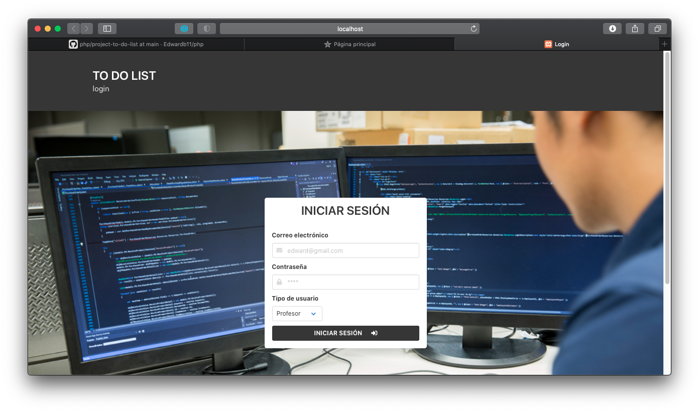
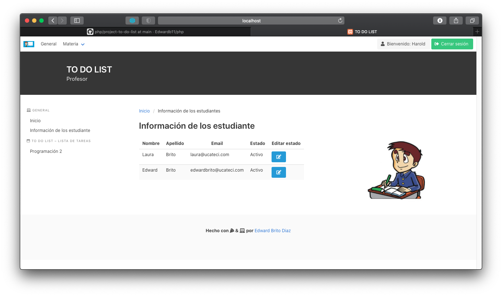
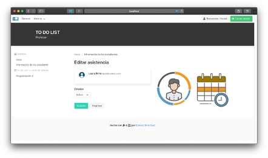
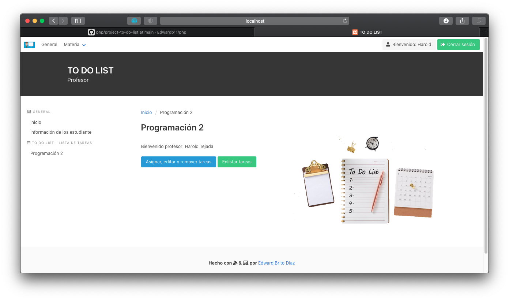
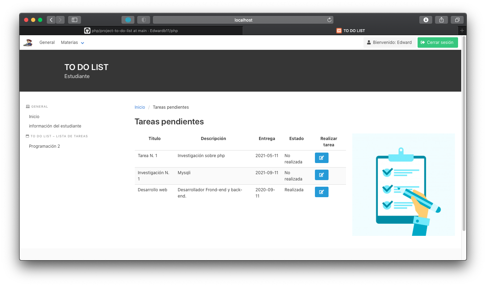

# _Manual de usuario_
**Pantalla 01: Login**
 
En esta pantalla el usuario introduce su correo electrónico y contraseña, además elige el tipo de usuario que es dependiendo su rol, profesor o estudiante.

**Pantalla 02 Profesor: Inicio**
 

Esta es la pantalla de inicio del profesor, contiene una bienvenida, donde además tiene acceso a un menú con diferentes opciones entre ellas, Inicio (actual pagina), información de los estudiantes y las materia que el profesor imparte, donde en esa podrá asignar tarea.

**Pantalla 03 Profesor: Información de los estudiantes**
 

Esta es la pantalla de información de los estudiantes donde el profesor puede ver todos los estudiantes y de igual forma puede pasar lista cambiando el estado.

**Pantalla 04 profesor: Editar asistencia**
 

Esta es la pantalla donde el profesor puede pasar lista, cambiando el estado del
estudiante.

**Pantalla 05 profesor: Programación 2**
 

Esta pantalla corresponde a la materia que imparte el profesor donde el mismo puede elegir una acción a realizar como asignar, editar, remover y enlistar tareas.

**Pantalla 06 profesor: Asignar, editar y remover tareas**
 

Esta pantalla corresponde a la materia que imparte el profesor donde el mismo ha elegido la opción de asignar, editar y remover tareas.

**Pantalla 07 profesor: Editar tareas**
 

Esta pantalla corresponde la modificación de una tarea.

**Pantalla 08 profesor: Enlistar tareas**
 

Esta pantalla corresponde a la materia que imparte el profesor donde el mismo ha elegido la opción de enlistar tarea.

**Pantalla 01: Login**
 

En esta pantalla el usuario introduce su correo electrónico y contraseña, además elige el tipo de usuario que es dependiendo su rol, profesor o estudiante.

**Pantalla 02 estudiante: Inicio**
 

Esta es la pantalla de inicio del estudiante, contiene una bienvenida, donde además tiene acceso a un menú con diferentes opciones entre ellas, Inicio (actual pagina), información del estudiante logueado y las materias que esta cursando.

**Pantalla 03 estudiante: Información del estudiante**
 

Esta es la pantalla se muestra la información del estudiante logueado.

**Pantalla 04 estudiante: Programación 2**
 

Esta es la pantalla donde el estudiante ve todas las asignaciones de la materia
correspondiente.

**Pantalla 05 estudiante: Realizar tarea**
 

Esta es la pantalla donde el estudiante podrá realizar la asignación seleccionada.

**Base de datos**
 
  
   

**El Modelo de Datos Entidad-Relación**

 